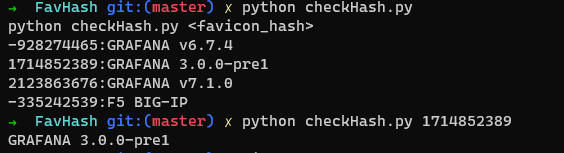

# FavHash

A Wordlist of favicon hash from various application
You can find all the favicon hash on list.txt file and combine it with shodan command-line tools.

Awesome Ideas From @delta0ne

# Contributions

Datasets contribution is much appreciated.

